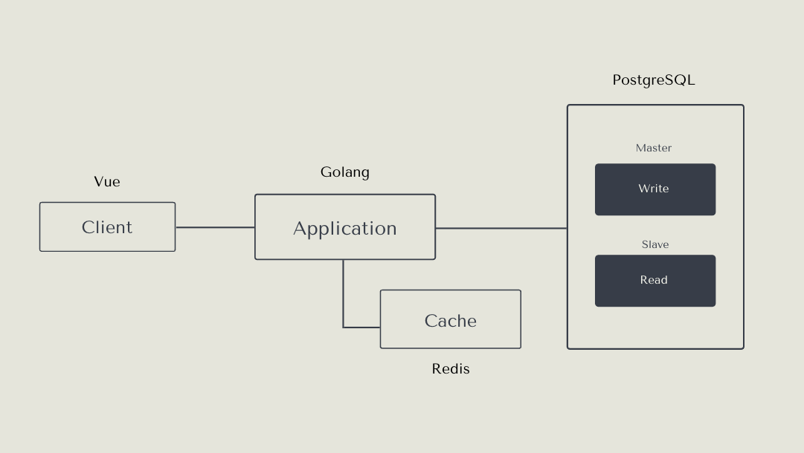
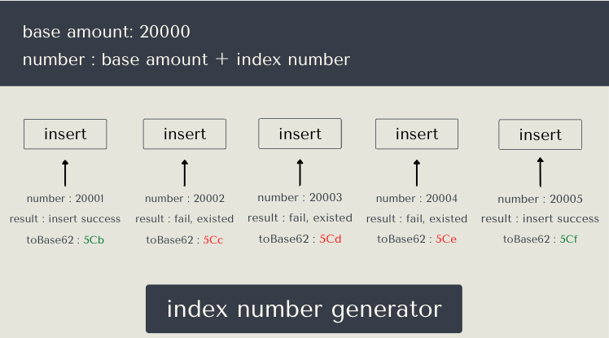
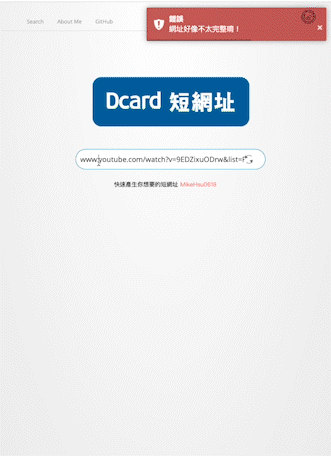
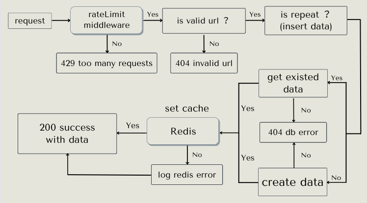
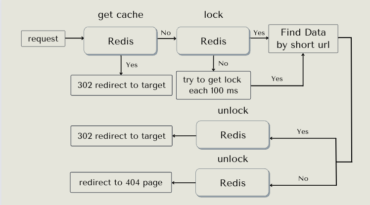

# dcard-project

2022 Dcard 後端實習作業題目：

請使用 Golang 或是 Node.js 設計以及實現出一套縮網址系統並且附上測試：

- 縮網址共有兩支 APIs, 請依照下列要求實現：
  - 一個可以上傳網址以及過期時間並返回縮網址的 Restful Api
  - 一個輸入縮網址就可以轉導到原網址的 API, 如過期則返回 404
- 請對這兩支 APIs, 做出合理的約束以及錯誤處理
- 不需考慮權限驗證問題
- 許多客戶端可能會同時發出請求或連接到不存在的縮網址, 請將效能問題納入考量 
- 請安心使用任何第三方套件

## 專案講解

### 目的

本專案以『盡可能的做出一個好的以及完整的縮網址服務體驗』為目標

所以建構了一個前後端環境來運行起整個完整的縮網址服務

### 縮網址好處

縮網址的好處非常多, 在於社群軟體上也有廣泛的使用, 在商業應用上還可以站在開發者角度針對縮網址進行流量與點擊等統計, 
挖掘出各種有價值的訊息, 對未來的決策有相當大的幫助
- 在 Twitter、微博等每條訊息有限制字數, 可以有效解決原網址字數過多的問題, 尤其在傳統文字短信上錙銖必較的字數, 不小心超過的話很容易多付出不少冤枉錢
- 跟 QRCode 有絕妙的搭配, 縮短過後的網址可以根本上的解決 QRCode 資料量越大或文字數愈多, `產生出來的圖片顆粒密度越大導致辨識度低落的痛點`
- 除了上述所說的, 縮網址對於 SEO 應用是非常靈活, 除了收集統計點擊數, 甚至可以因此知道使用者的使用裝置或是瀏覽器, 以及來自哪個網頁到轉導到哪個網頁,
大大的幫助我們建立出使用者的足跡以及輪廓

### 需求分析
小弟對此專案的需求了解分成下列幾點 :
- 需要一個前端輸入介面同時來呈現返回的縮網址相關資訊結果
- 一個正常情況下`讀大於寫`，且沒有`更新`需求的服務
- 有高流量高併發的可能
- 需要預防惡意多次請求攻擊
- 預設會是一個使用人數不少的功能
- 需要長期運行且穩定, 對資料量擴張以及持久性需要把持
- 在顧及上述條件時需兼顧性能以及一致性

### 使用環境及工具



- 前端: Javascript(Vue) 
- 後端: Golang(Gin, Gorm)
- 資料庫: PostgreSql
- 快取: Redis

### 工具選擇策略

#### 前端

使用較為熟悉的前端框架 Vue, 想為使用者帶來功能良好以及簡便的縮網址體驗

情境為只要使用者帶入原網址送出, 即可返回縮網址, Qrcode圖片, 該原網址爬蟲後得到的標題與預覽圖片, 加上一鍵複製功能

需要附上一個討喜的輸入介面, 以及 404 錯誤頁面

#### 後端

使用作業指定的 Golang 語言加上主流的 Gin 框架 搭配 Gorm, 處理 API Server 與 Database 的應用實現以及一致性問題

#### 資料庫

在一個會遇到高流量高併發讀多寫少且沒有更新需求的情境下, 使用主從式主寫分離關聯資料庫是非常合適的

所以我們使用 PostgreSql 作為關聯資料庫, 因為在比較 MySql 和 PostgreSql 之後, 認為 PostgreSql 的一些天然特性相較之下
是更適合本專案的應用

例如: 
- 兩者的 MVCC 機制在龐大資料量前提下, 理論上會是 PostgreSql 佔優
- Postgres 的天然 Index Auto Increment Gap 對本專案有恰到好處的策略用途
- Postgres 的主從復製屬於物理復製，相對於MySQL基於binlog的邏輯復製，數據的一致性更加可靠，復製性能更高，對主機性能的影響也更小

schema: 
```
// migrate up 

DROP TABLE IF EXISTS urls CASCADE;

CREATE TABLE urls
(
    id         BIGSERIAL,
    org_url    varchar(255) NOT NULL UNIQUE,
    
    // 如果有產生時間的排序需求, 非常建議在 created_at 加上索引
    created_at TIMESTAMP    NOT NULL DEFAULT NOW(),
    updated_at TIMESTAMP    NOT NULL DEFAULT NOW()
);

COMMENT ON COLUMN urls.org_url IS '原網址'

----------------------------------------------------

// migrate down
DROP table IF EXISTS urls;
```
#### 快取

同樣的在一個讀多寫少的且不會更新快取的情境下, 使用快取資料庫可以大大的提高效能以及體驗 

同時可以利用快取資料庫的特點實現分佈鎖以及去年 Dcard 作業中的主題 `IP 限制器` 來解決高併發以及請求限制的需求

所以我們使用主流且穩定的 Redis 作為快取資料庫, 沒有做出讀寫分離主要考量為
同時兼顧兩種資料庫叢集的一致性會使邏輯過度複雜, 不一定是眼前的最佳解, 
在隨著資料量循序漸進的增長, 本服務可以優先從架構面進行優化, 
例如: Auto Scaling, Load Balance, 來提升服務的負載能力以及可靠性


### 如何運行該專案(使用docker-compose)

可利用本專案的docker-compose.yaml會一次啟動Backend、PostgreSql、Redis，方便直接運行測試。請確保主機有docker環境，如果是Linux環境則需要另外安裝docker-compose套件。而如果是Windows、Mac則只需要安裝Docker Desktop即可。

#### Clone 專案

```bash
# 透過 git clone 專案到主機任意路徑下
git clone https://github.com/MikeHsu0618/dcard-project.git
```
#### 運行專案 (Docker 環境)

````bash
# 在本專案的根目錄下執行以下指令即可
# -d 代表背景運行(Optional)
docker compose up -d pg-master pg-slave dcard-project redis
````

```bash
# migrate/init schema
docker compose up -d migrate
```

#### Swagger Document
```
// 運行成功起後, 可於以下路徑顯示 API 文件
http://localhost:8080/swagger/index.html
```
### 如何實現縮網址服務

關於縮網址實現有許多做法，本專案說明如下：

1. 縮網址的產生策略探討：
經過研究發現, 一般長網址會透過雜湊函數轉成縮網址，由於雜湊演算法所計算出來的雜湊值（Hash Value）具有不可逆的性質，
因此需要將長縮網址關係儲存在DB中，透過縮網址來尋找對應的長網址，
但雜湊函 數無法避免「雜湊碰撞（collision）」，因此有一定機率會出現多個長網址對應到同一個縮網址，
當然，有很多解決碰撞的方法，代價是會增加系統的複雜度。


2. 採用 `發號策略`： 發號策略是這樣的，當一個新的連結過來時，發號器發一個號與之對應。往後只要有新連結過來，發號器不停發號就好。
舉個例子，第一個進來的連結發號器發0號，對應的短連結為 xx.xxx/0，第二個進來的連結發號器發1號，對應的短連結為 xx.xxx/1，以此類推。
   發號器發出的10進位制號需要轉換成62進位制，這樣可以大大縮短號碼轉換成字串後的長度。比如發號器發出 10,000,000,000 這個號碼，如果不轉換成62進位制，直接拼接在域名後面，得到這樣一個連結 xx.xxx/10000000000。將上面的號碼轉換成62進位制，結果為AOYKUa，長度只有6位，拼接得到的連結為 xx.xxx/AOYKUa。可以看得出，進位制轉換後得到的短連結長度變短了一些。6位62進位制數，對應的號碼空間為626，約等於568億。也就是說發號器可以發568億個號，這個號碼空間應該能夠滿足多數專案的需求了，所以基本上不用擔心發號器無號可發的情況。


3. 發號器的應用細節：本專案採用 PostgreSql 的 Auto Increment Primary Key 的值, 
利用主鍵自增並且 Unique 的特性當作天然的發號器依據, 透過發號器的號碼進行 10 轉 62 進制即可得到對應的縮網址,
省略了縮網址的值儲存可以大大了降低資料庫的資料量,
看到這裡可能就會有個謎之聲說你這樣連續發號 1, 2, 3, 4 的不是很容易被有心人士看出策略,
一個 loop 打爆你的服務嗎？

   所以本專案祭出幾個解決思路：
   1. 不要從 1 開始發號, 沒錯聽起來很簡單, 當我們服務初期發號量小的時候確實很容易猜出發號策略是連續的,
  但如果從一個相較大的基數開始發號, 以本專案的基數 `20000` 轉換下來就會是 `5Ca`,
  所以縮網址就會是 `基數＋ index 的 62 進制`, 取值只要將 `62 進制轉 10 進制 - 基數`
  即可獲得 `原網址 index`, 此舉降低了 `初期外人看出發號策略的機率`
   2. 而連續發號的問題可以利用, Postgres `sequences` 的特性為當他發出了自增的 index 值後, 不管該事務有沒有 rollback 都不會消耗額外性能對事務做第二次檢查,
   都會繼續遞增下去, 假設五次 `insert` 請求中有三次失敗 (1, 2(失敗), 3(失敗), 4(失敗), 5), 
   則資料庫此時將有兩筆資料, index id 分別為 `1, 5`, 減緩了 `發號數純粹連續` 的問題
   3. 藉由我們對`原網址`欄位下的 Unique 索引, 只要使用者只要輸入了`已存在資料庫的原網址`,
   即可天然的產生一次 `insert 失敗`, 產生 index 無規則不連續跳號並取得原有資料,
   此舉處理了 `使用者重複產生相同網址的問題` 以及 `給予合理可預期的天然操作失敗已達成跳號目的`
   4. 多次請求的問題採用 Redis 實現的 `IP 限制中介`, 對每個 IP 進行一小時內最多只能傳送 1000 次請求的限制,
   達成對請求過多的問題
   
   


4. 前端實現：使用前端 Vue 框架建構出使用者輸入介面, 當使用者輸入網址後送出時, 盡可能驗證該網址,
   例如：是否為 http:// 或 https:// 開頭合法網址. 是否為重複網址,並加入`淡入淡出動畫`以及`錯誤提示toast`顧及使用者體驗,
   傳入後端時再去 call 一次該網址, 如果成功即爬取該網頁的 meta 資訊連同縮網址一起傳回使用者介面,
   並且顯示出 `預覽圖片` `預覽標題` `Qrcode 圖片` `Copy 網址按鈕`, 錯誤則以錯誤提醒顯示。
   如使用者輸入正確`縮網址`則透過後端 302 轉導到正確`原網址`, 錯誤則轉導到 404 頁面

   

   


5. 後端實現：使用 Gin 框架運行 Server , 並加入 `PostgreSql 資料庫` `Redis IP 限制器中介` `Redis 分佈式鎖` `Redis 快取`
   來完成作業兩支指定 APIs
     1. `Post  "/" create short url` 收到前端的請求後新增的`原網址` -> call 一次該網址確認是否為合法網址,
     錯誤返回 `404 無效網址` 成功則繼續利用取得的 `requestBody` 取出 `Meta 資訊` 加入 response 中 ->
     將 `原網址` 存入資料庫取得 index id, 如 insert 失敗原因是網址已重複則取得該筆資料 index id, 不是則返回 `404 插入失敗`,
     取得 index id 值後加上預設基數轉成 62 進制即為產生出的`縮網址`, 此時本專案將 `index id` `原網址` 當作 key value 給定一定過期時間然後寫進 Redis 當作日後快取使用,
     最後將 `縮網址` `Meta 資訊` 回傳前端
     

     2. `Get "/link/:shortUrl" redirect to origin url` 當收到前端請求後, 將 62進制的短網址轉為 10 進制的 index id 並減去預設基數, 
       這時我們通常會直接去 Redis 查詢是否有快取存在, 有則返回值, 無則向資料庫查詢,
       但為了避免高併發情況下的效能負擔我們在此處加入 `Redis 分佈式鎖`, 有效預防有 1000 筆請求同時用同個網址對 Redis 查詢無果轉而資料庫進行 1000 次查詢的情況,
       而不是理想的只取第 1 筆資料 Redis 查詢無果後轉而查詢資料庫並建立快取, 第 2 ~ 1000 筆請求皆可以使用
       到第 1 筆請求建立的快取, 所以我們使用一個 `Redis 鎖` 去保證一次只有一個人去做讀取資料的動作, 
       成功取得 `原網址` 後則直接利用 `302 redirect` 轉導前端到該網頁
   
        

        > 這裡囉嗦一下301和302的跳轉在短連結服務使用場景下的區別：
             使用者第一次訪問某個短連結後，如果伺服器返回301狀態碼，
             則這個使用者在後續多次訪問統一短連結，瀏覽器會直接請求跳轉地址，
             而不是短連結地址，這樣一來伺服器端就無法收到使用者的請求。
             如果伺服器返回302狀態碼，且告知瀏覽器不快取短連結請求，
             那麼使用者每次訪問短連結，都會先去短連結服務端取回長連結地址，然後在跳轉。
             從語義上來說，301跳轉更為合適，因為是永久跳轉，不會每次都訪問服務端，還可以減小服務端壓力。
             但如果使用301跳轉，服務端就無法精確蒐集使用者的訪問行為了。
             相反302跳轉會導致服務端壓力增大，但服務端此時就可精確蒐集使用者的訪問行為。
             基於使用者的訪問行為，可以做一些分析，得出一些有意思的結論。
             比如可以根據使用者IP地址得出使用者區域分佈情況，
             根據User-Agent訊息頭分析出使用者使用不同的作業系統以及瀏覽器比例等等。
     
6. 資料庫細節： 當我們今天的業務一個讀多寫少且沒有更新需求的業務時, 使用讀寫分離資料庫的效益是非常高的,
   但把一個資料庫架構提升至讀寫分離, 甚至是一主多從的叢集資料庫, 需要處理的一致性問題會更加複雜,
   本專案因為沒有`更新`的需求可以很好的避過這些坑, 但我們對資料庫的每個操作都需要特別注意一些常見的狀況
   1. 情境 1 . 寫資料庫更新後和讀資料庫同步前讀取到舊資料的`主從資料不一致問題`  -> 短網址業務邏輯尚無更新需求故不用擔心此狀況,
   常見解法為`提升複製模式等級(犧牲效能)` `寫入後等待一小段時間不馬上讀` `對無錯誤容忍的資料使用主資料庫讀取(業務邏輯取捨)`
   2. 情境 2 : 寫資料庫更新後和讀資料庫同步前的讀取到舊資料並存入到緩存服務的`緩存服務不一致問題` -> 短網址業務邏輯尚無更新需求故不用擔心此狀況,
   此情況會造成緩存永遠都是錯的, 常見解法有 `更新完淘汰緩存並讀取主資料庫的該筆資料一次以建立緩存(僅能降低不一致機率)` `重複一次操作(如出現錯誤的快取會在第二次被淘汰)`
   `使用第三方套件監控快取與資料庫的一致性 ex. canal`


7. 快取細節： 在我們使用性能高默認單協程的 `Redis` 實現方便的快取功能以及實現 `IP 限制器`, 
   但同時也需要注意如果這麼好用的服務沒有預防到一些情況可是讓人很頭疼的啊
   1. 情境 1 ： 人為刻意或某種情況下, 有人瘋狂用不存在的 key 查找快取, 使請求得以繞過 Redis 直接向資料庫讀取造成 `緩存穿透` : 本專案使用 `IP 限制器` 限制了請求次數解決此問題,
   其他解決方案為 `對不存在的資料也進行緩存(給予適當過期時間)` `使用布隆過濾器( Bloom Filter )`
   2. 情境 2 : 當緩存在同一個時間內大量瞬間的失效或更新時產生的 `緩存雪崩`： 本專案使用 `IP 限制器` 也有效降低發生的可能性,
   在一般情況下此問題發生機率也頗低, 如果需要可以使用 `隊列服務` 或 `批量操作` 來避免
   3. 情境 3 : `緩存掛了` : 確保一切業務能在快取資料庫不運作的情況下正常運作, 畢竟資料還是存放在資料庫裡

### 總結

本專案為小弟從零學習 golang 的 demo 作品, 結合 Redis, PostgreSql, Docker, 練習系統設計與工具使用, 嘗試做出一個完整的服務