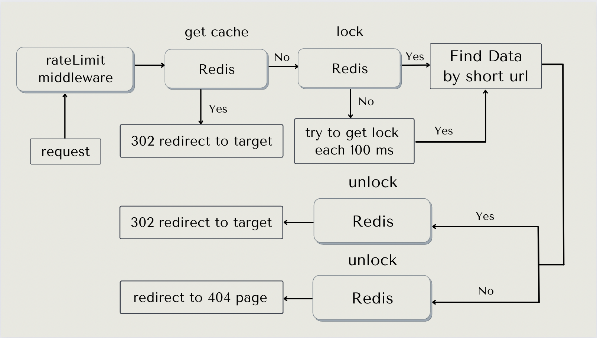

# 工具選擇策略

## 前端

使用較為熟悉的前端框架 Vue，想為使用者帶來功能良好以及簡便的短網址體驗

情境為只要使用者帶入原網址送出，即可返回短網址、Qrcode圖片以及該原網址爬蟲後得到的標題與預覽圖片，加上一鍵複製功能

需要附上一個討喜的輸入介面，以及 404 錯誤頁面

## 後端

使用作業指定的 Golang 語言加上主流的 Gin 框架 搭配 Gorm，處理 API Server 與 Database 的應用實現以及一致性問題

## 資料庫

在一個會遇到高流量高併發讀多寫少且沒有更新需求的情境下，使用主從式主寫分離關聯資料庫是非常合適的

所以我們使用 PostgreSql 作為關聯資料庫，因為在比較 MySql 和 PostgreSql 之後，認為 PostgreSql 的一些天然特性相較之下
是更適合本專案的應用

為何選擇 PostgreSql:
- 兩者的 MVCC 機制在龐大資料量前提下，理論上會是 PostgreSql 佔優
- Postgres 的天然 Index Auto Increment Gap 對本專案有恰到好處的策略用途
- Postgres 的主從複製屬於物理複製，相對於MySQL基於binlog的邏輯複製，數據的一致性更加可靠，複製性能更高，對主機性能的影響也更小

## 快取

同樣的在一個讀多寫少的且不會更新快取的情境下，使用快取資料庫可以大大的提高效能以及體驗

同時可以利用快取資料庫的特點實現分佈鎖以及去年 Dcard 作業中的主題 `IP 限制器` 來解決高併發以及請求限制的需求

所以我們使用主流且穩定的 Redis 作為快取資料庫，沒有做出讀寫分離主要考量為
同時兼顧兩種資料庫叢集的一致性會使邏輯過度複雜，不一定是眼前的最佳解，
在隨著資料量循序漸進的增長，本服務可以優先從架構面進行優化，
例如: Auto Scaling，Load Balance，來提升服務的負載能力以及可靠性

# 如何實現短網址服務

關於短網址實現有許多做法，本專案說明如下：

1. 短網址的產生策略探討：
   經過研究發現，一般長網址會透過雜湊函數轉成短網址，由於雜湊演算法所計算出來的雜湊值（Hash Value）具有不可逆的性質，
   因此需要將長短網址關係儲存在DB中，透過短網址來尋找對應的長網址，
   但雜湊函 數無法避免「雜湊碰撞（collision）」，因此有一定機率會出現多個長網址對應到同一個短網址，
   當然，有很多解決碰撞的方法，代價是會增加系統的複雜度。

2. 採用 `發號策略`： 發號策略是這樣的，當一個新的連結過來時，發號器發一個號與之對應。往後只要有新連結過來，發號器不停發號就好。
   舉個例子，第一個進來的連結發號器發0號，對應的短連結為 xx.xxx/0，第二個進來的連結發號器發1號，對應的短連結為 xx.xxx/1，以此類推。
   發號器發出的10進位制號需要轉換成62進位制，這樣可以大大縮短號碼轉換成字串後的長度。
   比如發號器發出 10,000,000,000 這個號碼，如果不轉換成62進位制，直接拼接在域名後面，得到這樣一個連結 xx.xxx/10000000000。
   將上面的號碼轉換成62進位制，結果為AOYKUa，長度只有6位，拼接得到的連結為 xx.xxx/AOYKUa。可以看得出，進位制轉換後得到的短連結長度變短了一些。
   6位62進位制數，對應的號碼空間為626，約等於568億。也就是說發號器可以發568億個號，這個號碼空間應該能夠滿足多數專案的需求了，所以基本上不用擔心發號器無號可發的情況。

3. 發號器的應用細節：本專案採用 PostgreSql 的 Auto Increment Primary Key 的值,
   利用主鍵自增並且 Unique 的特性當作天然的發號器依據，透過發號器的號碼進行 10 轉 62 進制即可得到對應的短網址,
   省略了短網址的值儲存可以大大了降低資料庫的資料量,
   看到這裡可能就會有個謎之聲說你這樣連續發號 1、2、3、4 的不是很容易被有心人士看出策略,
   一個 loop 打爆你的服務嗎？

   所以本專案祭出幾個解決思路：
    1. 不要從 1 開始發號，沒錯聽起來很簡單，當我們服務初期發號量小的時候確實很容易猜出發號策略是連續的,
       但如果從一個相較大的基數開始發號，以本專案的基數 `20000` 轉換下來就會是 `5Ca`,
       所以短網址就會是 `基數＋ index 的 62 進制`，取值只要將 `62 進制轉 10 進制 - 基數`
       即可獲得 `原網址 index`，此舉降低了 `初期外人看出發號策略的機率`
    2. 而連續發號的問題可以利用，Postgres `sequences` 的特性為當他發出了自增的 index 值後，不管該事務有沒有 rollback 都不會消耗額外性能對事務做第二次檢查,
       都會繼續遞增下去，假設五次 `insert` 請求中有三次失敗 (1，2(失敗)，3(失敗)，4(失敗)，5),
       則資料庫此時將有兩筆資料，index id 分別為 `1，5`，減緩了 `發號數純粹連續` 的問題
    3. 藉由我們對`原網址`欄位下的 Unique 索引，只要使用者只要輸入了`已存在資料庫的原網址`,
       即可天然的產生一次 `insert 失敗`，產生 index 無規則不連續跳號並取得原有資料,
       此舉處理了 `使用者重複產生相同網址的問題` 以及 `給予合理可預期的天然操作失敗已達成跳號目的`
    4. 多次請求的問題採用 Redis 實現的 `IP 限制中介`，對每個 IP 進行一分鐘內最多只能傳送 100 次請求的限制,
       達成對請求過多的問題

   

4. 前端實現：使用前端 Vue 框架建構出使用者輸入介面，當使用者輸入網址後送出時，盡可能驗證該網址,
   例如：是否為 http:// 或 https:// 開頭合法網址. 是否為重複網址,並加入`淡入淡出動畫`以及`錯誤提示toast`顧及使用者體驗,
   傳入後端時再去 call 一次該網址，如果成功即爬取該網頁的 meta 資訊連同短網址一起傳回使用者介面,
   並且顯示出 `預覽圖片` `預覽標題` `Qrcode 圖片` `Copy 網址按鈕`，錯誤則以錯誤提醒顯示。
   如使用者輸入正確`短網址`則透過後端 302 轉導到正確`原網址`，錯誤則轉導到 404 頁面

   

   

5. 後端實現：使用 Gin 框架運行 Server ，並加入 `PostgreSql 資料庫`、`Redis IP 限制器中介`、`Redis 分佈式鎖`、`Redis 快取`
   來完成作業兩支指定 APIs
    1. `Post  "/" create short url` 收到前端的請求後新增的`原網址` -> call 一次該網址確認是否為合法網址,
       錯誤返回 `404 無效網址` 成功則繼續利用取得的 `requestBody` 取出 `Meta 資訊` 加入 response 中 ->
       將 `原網址` 存入資料庫取得 index id，如 insert 失敗原因是網址已重複則取得該筆資料 index id，不是則返回 `404 插入失敗`,
       取得 index id 值後加上預設基數轉成 62 進制即為產生出的`短網址`，此時本專案將 `index id` `原網址` 當作 key value 給定一定過期時間然後寫進 Redis 當作日後快取使用,
       最後將 `短網址` `Meta 資訊` 回傳前端
       

    2. `Get "/link/:shortUrl" redirect to origin url` 當收到前端請求後，將 62進制的短網址轉為 10 進制的 index id 並減去預設基數,
       這時我們通常會直接去 Redis 查詢是否有快取存在，有則返回值，無則向資料庫查詢,
       但為了避免高併發情況下的效能負擔我們在此處加入 `Redis 分佈式鎖`，有效預防有 1000 筆請求同時用同個網址對 Redis 查詢無果轉而資料庫進行 1000 次查詢的情況,
       而不是理想的只取第 1 筆資料 Redis 查詢無果後轉而查詢資料庫並建立快取，第 2 ~ 1000 筆請求皆可以使用
       到第 1 筆請求建立的快取，所以我們使用一個 `Redis 鎖` 去保證一次只有一個人去做讀取資料的動作,
       成功取得 `原網址` 後則直接利用 `302 redirect` 轉導前端到該網頁

       

       > 這裡囉嗦一下301和302的跳轉在短連結服務使用場景下的區別：
       使用者第一次訪問某個短連結後，如果伺服器返回301狀態碼，
       則這個使用者在後續多次訪問統一短連結，瀏覽器會直接請求跳轉地址，
       而不是短連結地址，這樣一來伺服器端就無法收到使用者的請求。
       如果伺服器返回302狀態碼，且告知瀏覽器不快取短連結請求，
       那麼使用者每次訪問短連結，都會先去短連結服務端取回長連結地址，然後在跳轉。
       從語義上來說，301跳轉更為合適，因為是永久跳轉，不會每次都訪問服務端，還可以減小服務端壓力。
       但如果使用301跳轉，服務端就無法精確蒐集使用者的訪問行為了。
       相反302跳轉會導致服務端壓力增大，但服務端此時就可精確蒐集使用者的訪問行為。
       基於使用者的訪問行為，可以做一些分析，得出一些有意思的結論。
       比如可以根據使用者IP地址得出使用者區域分佈情況，
       根據User-Agent訊息頭分析出使用者使用不同的作業系統以及瀏覽器比例等等。

6. 資料庫細節： 當我們今天的業務一個讀多寫少且沒有更新需求的業務時，使用讀寫分離資料庫的效益是非常高的,
   但把一個資料庫架構提升至讀寫分離，甚至是一主多從的叢集資料庫，需要處理的一致性問題會更加複雜,
   本專案因為沒有`更新`的需求可以很好的避過這些坑，但我們對資料庫的每個操作都需要特別注意一些常見的狀況
    1. 情境 1 . 寫資料庫更新後和讀資料庫同步前讀取到舊資料的`主從資料不一致問題`  -> 短網址業務邏輯尚無更新需求故不用擔心此狀況,
       常見解法為`提升複製模式等級(犧牲效能)` `寫入後等待一小段時間不馬上讀` `對無錯誤容忍的資料使用主資料庫讀取(業務邏輯取捨)`
    2. 情境 2 : 寫資料庫更新後和讀資料庫同步前的讀取到舊資料並存入到緩存服務的`緩存服務不一致問題` -> 短網址業務邏輯尚無更新需求故不用擔心此狀況,
       此情況會造成緩存永遠都是錯的，常見解法有 `更新完淘汰緩存並讀取主資料庫的該筆資料一次以建立緩存(僅能降低不一致機率)` `重複一次操作(如出現錯誤的快取會在第二次被淘汰)`
       `使用第三方套件監控快取與資料庫的一致性 ex. canal`

7. 快取細節： 在我們使用性能高默認單協程的 `Redis` 實現方便的快取功能以及實現 `IP 限制器`,
   但同時也需要注意如果這麼好用的服務沒有預防到一些情況可是讓人很頭疼的啊
    1. 情境 1 ： 人為刻意或某種情況下，有人瘋狂用不存在的 key 查找快取，使請求得以繞過 Redis 直接向資料庫讀取造成 `緩存穿透` : 本專案使用 `IP 限制器` 限制了請求次數解決此問題,
       其他解決方案為 `對不存在的資料也進行緩存(給予適當過期時間)` `使用布隆過濾器( Bloom Filter )`
    2. 情境 2 : 當緩存在同一個時間內大量瞬間的失效或更新時產生的 `緩存雪崩`： 本專案使用 `IP 限制器` 也有效降低發生的可能性,
       在一般情況下此問題發生機率也頗低，如果需要可以使用 `隊列服務` 或 `批量操作` 來避免
    3. 情境 3 : `緩存掛了` : 確保一切業務能在快取資料庫不運作的情況下正常運作，畢竟資料還是存放在資料庫裡

小結：上述的架構遇到真正的惡意攻擊如 `DDoS`，其實還是不足以防禦的，到時候可能需要借助各層級系統的層層防線，小至 `Nginx` `雲端服務 ex AWS Shield`,
大到 `DNS服務商`，才能稍微從根本上處理這個問題，提升服務穩定性，也將是未來持續精進的方向